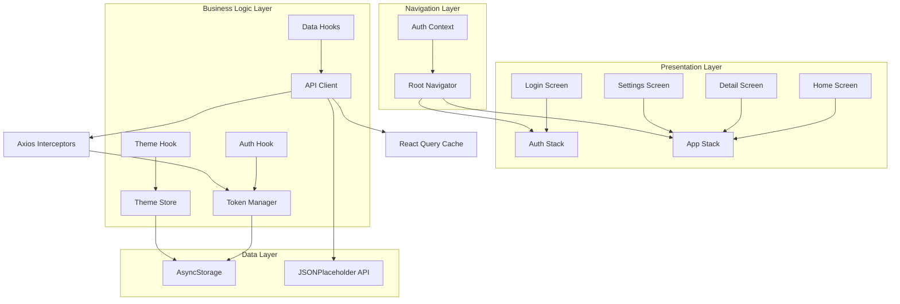
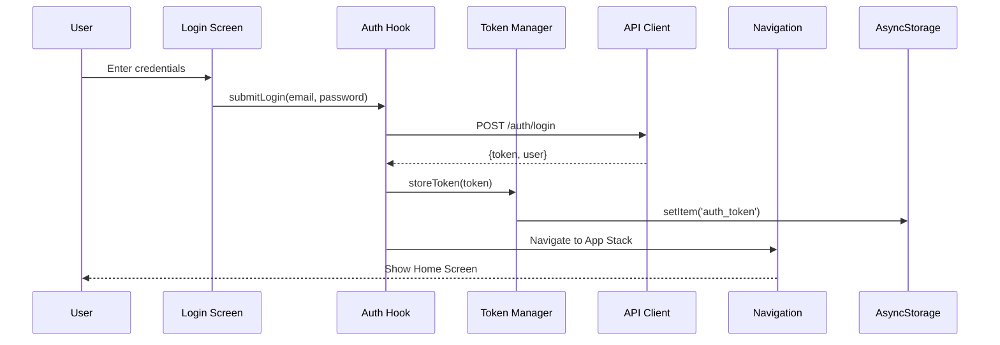
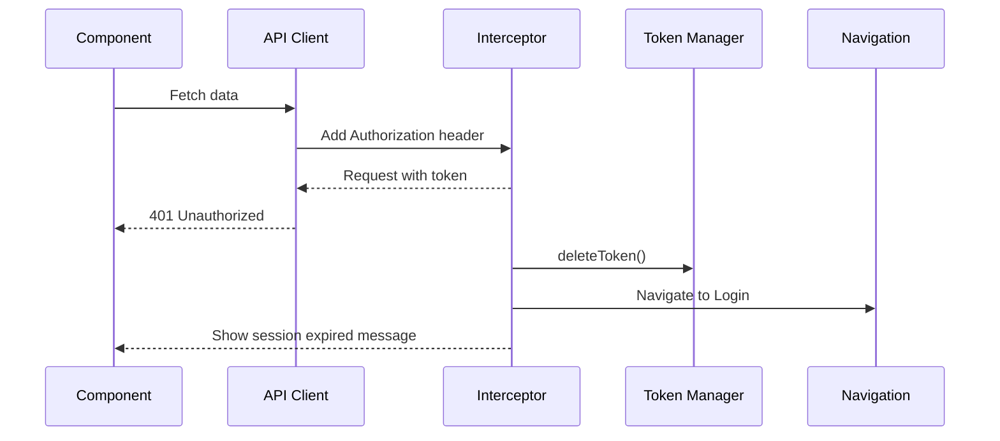

# Design Document: Auth Starter Project

## Overview

This design transforms the existing Movie Search App into a production-ready React Native starter project with JWT authentication. The transformation involves:

1. **Authentication System**: Implementing JWT-based login with secure token management
2. **Navigation Architecture**: Separating auth and app navigation stacks with automatic routing based on authentication state
3. **API Migration**: Replacing TMDB API with JSONPlaceholder (https://jsonplaceholder.typicode.com) for a key-free public API
4. **Modern UI/UX**: Implementing skeleton loaders, error boundaries, empty states, and fintech-style design patterns
5. **Clean Architecture**: Feature-based folder structure with separation of concerns

The design leverages existing infrastructure (React Query, Zustand, theme system, AsyncStorage) while adding authentication capabilities and modernizing the UI patterns.

## Architecture

### High-Level Architecture



### Authentication Flow



### Token Expiration Flow



## Components and Interfaces

### 1. Authentication Module

**Location**: `src/features/auth/`

#### AuthService (`services/authService.ts`)

```typescript
interface LoginCredentials {
  email: string;
  password: string;
}

interface AuthResponse {
  token: string;
  user: {
    id: number;
    email: string;
    name: string;
  };
}

class AuthService {
  async login(credentials: LoginCredentials): Promise<AuthResponse>
  async logout(): Promise<void>
  async validateToken(token: string): Promise<boolean>
}
```

**Implementation Notes**:
- Uses JSONPlaceholder's `/users` endpoint to simulate authentication
- For demo purposes, accepts any email/password combination (minimum validation only)
- Returns a mock JWT token (base64 encoded user data for demo)
- In production, this would call a real authentication endpoint

#### TokenManager (`services/tokenManager.ts`)

```typescript
interface TokenManager {
  storeToken(token: string): Promise<void>
  getToken(): Promise<string | null>
  deleteToken(): Promise<void>
  hasToken(): Promise<boolean>
}
```

**Implementation Notes**:
- Abstracts AsyncStorage access behind a clean interface
- Uses consistent key: `@auth_token`
- Provides synchronous and asynchronous methods
- Never exposes AsyncStorage directly to other modules

#### useAuth Hook (`hooks/useAuth.ts`)

```typescript
interface UseAuthReturn {
  login: (email: string, password: string) => Promise<void>
  logout: () => Promise<void>
  isLoading: boolean
  error: string | null
  user: User | null
}

function useAuth(): UseAuthReturn
```

**Implementation Notes**:
- Manages authentication state using Zustand store
- Handles login/logout operations
- Provides loading and error states
- Integrates with TokenManager for persistence

#### Login Screen (`screens/LoginScreen.tsx`)

**UI Components**:
- Email input with validation (email format)
- Password input with secure entry (minimum 6 characters)
- Submit button with loading state
- Error message display
- Keyboard handling (dismiss on tap outside, next/done actions)

**Validation**:
- Email: Must match email regex pattern
- Password: Minimum 6 characters
- Display inline errors below each field

### 2. Navigation Module

**Location**: `src/navigation/`

#### Navigation Structure

```typescript
// Auth Stack
type AuthStackParamList = {
  Login: undefined;
};

// App Stack
type AppStackParamList = {
  Tabs: undefined;
  Detail: { itemId: number };
};

// Root Navigator
type RootStackParamList = {
  Auth: NavigatorScreenParams<AuthStackParamList>;
  App: NavigatorScreenParams<AppStackParamList>;
};
```

#### RootNavigator (`RootNavigator.tsx`)

**Responsibilities**:
- Check for stored token on app launch
- Render Auth stack if no token exists
- Render App stack if valid token exists
- Listen for authentication state changes
- Prevent back navigation from App to Auth stack

**Implementation Pattern**:
```typescript
const RootNavigator = () => {
  const { isAuthenticated, isLoading } = useAuth();
  
  if (isLoading) {
    return <SplashScreen />;
  }
  
  return (
    <Stack.Navigator screenOptions={{ headerShown: false }}>
      {isAuthenticated ? (
        <Stack.Screen name="App" component={AppNavigator} />
      ) : (
        <Stack.Screen name="Auth" component={AuthNavigator} />
      )}
    </Stack.Navigator>
  );
};
```

### 3. API Client Module

**Location**: `src/services/api/`

#### API Client Configuration (`client.ts`)

```typescript
const apiClient = axios.create({
  baseURL: 'https://jsonplaceholder.typicode.com',
  timeout: 10000,
  headers: {
    'Content-Type': 'application/json',
  },
});
```

#### Request Interceptor

**Responsibilities**:
- Add Authorization header with JWT token
- Add request logging for debugging
- Handle request configuration

```typescript
apiClient.interceptors.request.use(
  async (config) => {
    const token = await TokenManager.getToken();
    if (token) {
      config.headers.Authorization = `Bearer ${token}`;
    }
    return config;
  },
  (error) => Promise.reject(error)
);
```

#### Response Interceptor

**Responsibilities**:
- Handle 401 Unauthorized (token expiration)
- Implement retry logic (max 2 retries)
- Log errors with context
- Trigger automatic logout on 401

```typescript
apiClient.interceptors.response.use(
  (response) => response,
  async (error) => {
    if (error.response?.status === 401) {
      await TokenManager.deleteToken();
      // Trigger navigation to login
      // Show session expired message
    }
    
    // Retry logic for network errors
    const config = error.config;
    if (!config || !config.retry) {
      config.retry = 0;
    }
    
    if (config.retry < 2) {
      config.retry += 1;
      return apiClient(config);
    }
    
    return Promise.reject(error);
  }
);
```

### 4. Data Fetching Hooks

**Location**: `src/hooks/`

#### useItems Hook (replaces useMovies)

```typescript
interface Item {
  id: number;
  title: string;
  body: string;
  userId: number;
}

function useItems() {
  return useQuery<Item[]>({
    queryKey: ['items'],
    queryFn: () => apiClient.get('/posts').then(res => res.data),
    staleTime: 5 * 60 * 1000,
    cacheTime: 10 * 60 * 1000,
  });
}
```

#### useItemDetail Hook (replaces useMovieDetail)

```typescript
function useItemDetail(id: number) {
  return useQuery<Item>({
    queryKey: ['item', id],
    queryFn: () => apiClient.get(`/posts/${id}`).then(res => res.data),
    enabled: !!id,
  });
}
```

### 5. UI Components

**Location**: `src/components/`

#### LoadingSkeleton Component

**Purpose**: Replace spinner indicators with modern shimmer-based skeleton loaders

**Props**:
```typescript
interface LoadingSkeletonProps {
  width?: number | string;
  height?: number | string;
  borderRadius?: number;
  style?: ViewStyle;
}
```

**Implementation**:
- Uses Animated API for shimmer effect
- Animates from left to right with gradient overlay
- Configurable dimensions and border radius
- Matches theme colors (light/dark mode)

#### ErrorState Component

**Purpose**: Display error messages with retry functionality

**Props**:
```typescript
interface ErrorStateProps {
  message: string;
  onRetry: () => void;
  icon?: string;
}
```

**UI Elements**:
- Error icon (centered)
- Error message (user-friendly, not technical)
- Retry button
- Consistent spacing and typography

#### EmptyState Component

**Purpose**: Display when API returns no data

**Props**:
```typescript
interface EmptyStateProps {
  message: string;
  icon?: string;
  action?: {
    label: string;
    onPress: () => void;
  };
}
```

#### CardItem Component (replaces MovieCard)

**Purpose**: Reusable card for displaying list items

**Props**:
```typescript
interface CardItemProps {
  item: Item;
  onPress: (id: number) => void;
}
```

**UI Structure**:
- Card container with shadow and border radius
- Title (heading typography)
- Body text (truncated, body typography)
- Touchable with opacity feedback
- Fade-in animation on mount

### 6. Feature-Based Folder Structure

```
src/
├── features/
│   ├── auth/
│   │   ├── screens/
│   │   │   └── LoginScreen.tsx
│   │   ├── hooks/
│   │   │   └── useAuth.ts
│   │   ├── services/
│   │   │   ├── authService.ts
│   │   │   └── tokenManager.ts
│   │   └── types/
│   │       └── auth.types.ts
│   ├── home/
│   │   ├── screens/
│   │   │   └── HomeScreen.tsx
│   │   ├── components/
│   │   │   └── ItemList.tsx
│   │   └── hooks/
│   │       └── useItems.ts
│   └── detail/
│       ├── screens/
│       │   └── DetailScreen.tsx
│       └── hooks/
│           └── useItemDetail.ts
├── components/          # Shared components
│   ├── CardItem.tsx
│   ├── LoadingSkeleton.tsx
│   ├── ErrorState.tsx
│   └── EmptyState.tsx
├── navigation/
│   ├── RootNavigator.tsx
│   ├── AuthNavigator.tsx
│   └── AppNavigator.tsx
├── services/
│   └── api/
│       └── client.ts
├── hooks/              # Shared hooks
│   └── useAppTheme.ts
├── stores/             # Zustand stores
│   ├── useAuthStore.ts
│   └── useSettingsStore.ts
├── theme/
│   └── index.ts
└── types/
    └── api.types.ts
```

## Data Models

### Authentication Models

```typescript
// User model
interface User {
  id: number;
  email: string;
  name: string;
}

// Login credentials
interface LoginCredentials {
  email: string;
  password: string;
}

// Auth response from API
interface AuthResponse {
  token: string;
  user: User;
}

// Auth store state
interface AuthState {
  user: User | null;
  token: string | null;
  isAuthenticated: boolean;
  isLoading: boolean;
  error: string | null;
  login: (email: string, password: string) => Promise<void>;
  logout: () => Promise<void>;
  checkAuth: () => Promise<void>;
}
```

### API Models (replacing Movie types)

```typescript
// Generic item from JSONPlaceholder /posts
interface Item {
  userId: number;
  id: number;
  title: string;
  body: string;
}

// User from JSONPlaceholder /users
interface ApiUser {
  id: number;
  name: string;
  username: string;
  email: string;
  address: Address;
  phone: string;
  website: string;
  company: Company;
}

interface Address {
  street: string;
  suite: string;
  city: string;
  zipcode: string;
  geo: {
    lat: string;
    lng: string;
  };
}

interface Company {
  name: string;
  catchPhrase: string;
  bs: string;
}
```

### Theme Models (existing, enhanced)

```typescript
interface Theme {
  colors: ColorPalette;
  spacing: Spacing;
  typography: Typography;
  borderRadius: BorderRadius;
  shadows: Shadows;
}

interface ColorPalette {
  primary: string;
  secondary: string;
  accent: string;
  background: string;
  surface: string;
  card: string;
  text: {
    primary: string;
    secondary: string;
    inverse: string;
    link: string;
  };
  border: string;
  error: string;
  success: string;
  warning: string;
  skeleton: string;
}

interface Spacing {
  xs: number;   // 4
  sm: number;   // 8
  md: number;   // 12
  lg: number;   // 16
  xl: number;   // 20
  xxl: number;  // 24
  xxxl: number; // 32
}
```

## Error Handling

### Error Categories

1. **Network Errors**: No internet connection or timeout
2. **Authentication Errors**: Invalid credentials, expired token
3. **API Errors**: 4xx/5xx responses from server
4. **Validation Errors**: Client-side input validation failures

### Error Handling Strategy

#### Network Errors
- **Detection**: Axios error with no response object
- **User Message**: "No internet connection. Please check your network."
- **Action**: Provide retry button
- **Logging**: Log error with timestamp and endpoint

#### Authentication Errors (401)
- **Detection**: Response status 401
- **Action**: Automatic logout, clear token, navigate to login
- **User Message**: "Your session has expired. Please log in again."
- **Logging**: Log token expiration event

#### API Errors (4xx/5xx)
- **Detection**: Response status >= 400
- **User Message**: Generic user-friendly message (not technical details)
- **Action**: Display ErrorState component with retry
- **Logging**: Log status code, endpoint, and error message

#### Validation Errors
- **Detection**: Client-side validation before API call
- **User Message**: Specific field-level error messages
- **Action**: Display inline below input field
- **Logging**: No logging needed (client-side only)

### Retry Logic

**Configuration**:
- Maximum retries: 2
- Retry delay: Exponential backoff (1s, 2s)
- Retry conditions: Network errors, 5xx errors
- No retry: 4xx errors (except 401)

**Implementation**:
```typescript
const retryRequest = async (config: AxiosRequestConfig, retryCount: number = 0) => {
  try {
    return await apiClient(config);
  } catch (error) {
    if (retryCount < 2 && shouldRetry(error)) {
      await delay(Math.pow(2, retryCount) * 1000);
      return retryRequest(config, retryCount + 1);
    }
    throw error;
  }
};
```

### Error Logging

**Log Format**:
```typescript
interface ErrorLog {
  timestamp: string;
  type: 'network' | 'api' | 'auth' | 'validation';
  endpoint?: string;
  statusCode?: number;
  message: string;
  userId?: number;
}
```

**Logging Strategy**:
- Console logging in development
- Structured logging for production (ready for integration with services like Sentry)
- Include context: user ID, endpoint, timestamp
- Sanitize sensitive data (passwords, tokens)

## Testing Strategy

### Unit Testing

**Focus Areas**:
1. **Token Manager**: Store, retrieve, delete operations
2. **Auth Service**: Login, logout, token validation
3. **Validation Functions**: Email format, password requirements
4. **Utility Functions**: Formatters, helpers

**Example Tests**:
```typescript
describe('TokenManager', () => {
  it('should store and retrieve token', async () => {
    await TokenManager.storeToken('test-token');
    const token = await TokenManager.getToken();
    expect(token).toBe('test-token');
  });
  
  it('should return null when no token exists', async () => {
    await TokenManager.deleteToken();
    const token = await TokenManager.getToken();
    expect(token).toBeNull();
  });
});

describe('Email Validation', () => {
  it('should accept valid email formats', () => {
    expect(validateEmail('user@example.com')).toBe(true);
  });
  
  it('should reject invalid email formats', () => {
    expect(validateEmail('invalid-email')).toBe(false);
  });
});
```

### Integration Testing

**Focus Areas**:
1. **Authentication Flow**: Login → Token Storage → Navigation
2. **API Integration**: Request interceptors, response handling
3. **Navigation Flow**: Auth stack ↔ App stack transitions
4. **Token Expiration**: 401 response → Logout → Login screen

**Example Tests**:
```typescript
describe('Authentication Flow', () => {
  it('should navigate to app stack after successful login', async () => {
    const { getByPlaceholderText, getByText } = render(<App />);
    
    fireEvent.changeText(getByPlaceholderText('Email'), 'user@example.com');
    fireEvent.changeText(getByPlaceholderText('Password'), 'password123');
    fireEvent.press(getByText('Login'));
    
    await waitFor(() => {
      expect(getByText('Home')).toBeTruthy();
    });
  });
});
```

### Component Testing

**Focus Areas**:
1. **Login Screen**: Input validation, error display, loading states
2. **LoadingSkeleton**: Animation, theme integration
3. **ErrorState**: Retry functionality, message display
4. **CardItem**: Press handling, data display

**Example Tests**:
```typescript
describe('LoginScreen', () => {
  it('should display validation error for invalid email', async () => {
    const { getByPlaceholderText, getByText } = render(<LoginScreen />);
    
    fireEvent.changeText(getByPlaceholderText('Email'), 'invalid');
    fireEvent.press(getByText('Login'));
    
    expect(getByText('Please enter a valid email')).toBeTruthy();
  });
});
```

### End-to-End Testing

**Focus Areas**:
1. **Complete User Journey**: Launch → Login → Browse → Detail → Logout
2. **Token Persistence**: App restart with valid token
3. **Network Error Recovery**: Offline → Online → Retry
4. **Theme Switching**: Light ↔ Dark mode transitions

**Tools**: Detox or Maestro for React Native E2E testing

### Testing Configuration

**Jest Configuration**:
```javascript
module.exports = {
  preset: 'react-native',
  setupFilesAfterEnv: ['<rootDir>/jest.setup.js'],
  transformIgnorePatterns: [
    'node_modules/(?!(react-native|@react-native|@react-navigation)/)',
  ],
  collectCoverageFrom: [
    'src/**/*.{ts,tsx}',
    '!src/**/*.types.ts',
    '!src/**/*.d.ts',
  ],
  coverageThreshold: {
    global: {
      statements: 70,
      branches: 70,
      functions: 70,
      lines: 70,
    },
  },
};
```

**Test Organization**:
```
__tests__/
├── unit/
│   ├── services/
│   │   ├── tokenManager.test.ts
│   │   └── authService.test.ts
│   └── utils/
│       └── validation.test.ts
├── integration/
│   ├── auth-flow.test.tsx
│   └── api-client.test.ts
├── components/
│   ├── LoginScreen.test.tsx
│   ├── LoadingSkeleton.test.tsx
│   └── ErrorState.test.tsx
└── e2e/
    └── user-journey.e2e.ts
```

### Testing Best Practices

1. **Mock External Dependencies**: Mock AsyncStorage, API calls, navigation
2. **Test User Behavior**: Focus on user interactions, not implementation details
3. **Snapshot Testing**: Use sparingly, only for stable UI components
4. **Accessibility Testing**: Test screen reader labels, touch targets
5. **Performance Testing**: Monitor render counts, memory usage

## Implementation Notes

### Phase 1: Authentication Foundation
1. Create TokenManager service
2. Create AuthService with mock authentication
3. Create useAuth hook and AuthStore
4. Implement LoginScreen with validation
5. Update RootNavigator for auth flow

### Phase 2: API Migration
1. Update API client configuration (remove TMDB, add JSONPlaceholder)
2. Create new data models (Item, ApiUser)
3. Update hooks (useItems, useItemDetail)
4. Remove movie-specific types and services

### Phase 3: UI Modernization
1. Create LoadingSkeleton component
2. Create ErrorState component
3. Create EmptyState component
4. Update CardItem component (from MovieCard)
5. Update screens to use new components

### Phase 4: Feature Restructuring
1. Reorganize into feature-based folders
2. Move auth code to features/auth
3. Move home code to features/home
4. Move detail code to features/detail
5. Update imports across codebase

### Phase 5: Testing & Polish
1. Write unit tests for core services
2. Write integration tests for auth flow
3. Write component tests for screens
4. Add E2E tests for critical paths
5. Performance optimization and cleanup

### Migration Considerations

**Preserving Existing Features**:
- Theme system (light/dark mode) - Keep as-is
- Settings screen - Keep and add logout button
- AsyncStorage utilities - Extend for token management
- React Query configuration - Keep existing setup

**Removing Features**:
- TMDB API integration
- Movie-specific types and models
- Favorites functionality (can be re-added later)
- Search functionality (can be re-added later)
- Reviews functionality (can be re-added later)

**Environment Variables**:
- Remove: `TMDB_API_KEY`
- Add: `API_BASE_URL` (optional, defaults to JSONPlaceholder)

### Security Considerations

1. **Token Storage**: Use AsyncStorage (encrypted on iOS, keychain-backed)
2. **Token Transmission**: Always use HTTPS, include in Authorization header
3. **Input Validation**: Client-side validation before API calls
4. **Error Messages**: Never expose sensitive information in error messages
5. **Logout**: Clear all user data and tokens completely

### Performance Optimizations

1. **Memoization**: Use React.memo for list items and cards
2. **FlatList Optimization**: keyExtractor, initialNumToRender, getItemLayout
3. **Image Loading**: Lazy loading, placeholder images
4. **Bundle Size**: Code splitting, tree shaking
5. **Animation**: Use native driver for animations

### Accessibility

1. **Screen Reader**: Add accessibilityLabel to all interactive elements
2. **Touch Targets**: Minimum 44x44pt for all touchable elements
3. **Color Contrast**: WCAG AA compliance for text and backgrounds
4. **Focus Management**: Proper focus order for keyboard navigation
5. **Error Announcements**: Use accessibilityLiveRegion for dynamic errors

### Future Enhancements

1. **Biometric Authentication**: Face ID / Touch ID support
2. **Refresh Tokens**: Implement token refresh flow
3. **Social Login**: Google, Apple, Facebook authentication
4. **Offline Support**: Cache data for offline viewing
5. **Push Notifications**: User engagement and updates
6. **Analytics**: Track user behavior and errors
7. **Internationalization**: Multi-language support
8. **Onboarding**: First-time user tutorial

