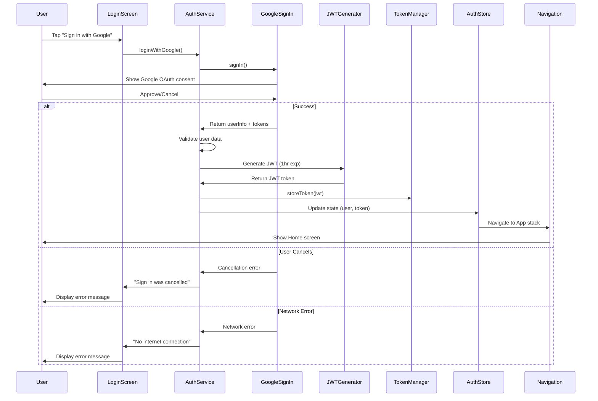

# Design Document: Google OAuth Authentication

## Overview

This design implements Google OAuth authentication to replace the current mock authentication system. The solution integrates the `@react-native-google-signin/google-signin` library for OAuth flow, uses `jsonwebtoken` for JWT generation with 1-hour expiration, and maintains compatibility with existing authentication infrastructure (AuthService, TokenManager, AuthStore).

The design preserves the existing navigation flow, token storage mechanism, and user state management while replacing the mock JSONPlaceholder authentication with real Google OAuth.

### Key Design Decisions

1. **JWT Generation on Client**: Generate JWT tokens client-side after Google OAuth success rather than fetching from a backend. This maintains the demo/starter project nature while providing realistic token handling.

2. **Reuse Existing Infrastructure**: Leverage existing TokenManager, AuthStore, and navigation logic to minimize changes and maintain consistency.

3. **Platform-Specific Configuration**: Handle iOS and Android OAuth configuration differences through platform-specific setup files (Info.plist, build.gradle).

4. **Graceful Error Handling**: Distinguish between user cancellation, network errors, and authentication failures with specific error messages.

## Architecture

### Component Interaction Flow



### System Architecture

```mermaid
graph TB
    subgraph "UI Layer"
        LoginScreen[LoginScreen]
        HomeScreen[HomeScreen]
        SettingsScreen[SettingsScreen]
    end
    
    subgraph "State Management"
        AuthStore[AuthStore - Zustand]
    end
    
    subgraph "Service Layer"
        AuthService[AuthService]
        TokenManager[TokenManager]
        JWTService[JWT Service]
    end
    
    subgraph "External"
        GoogleOAuth[@react-native-google-signin]
        AsyncStorage[AsyncStorage]
    end
    
    LoginScreen -->|loginWithGoogle| AuthService
    SettingsScreen -->|logout| AuthService
    AuthService -->|signIn/signOut| GoogleOAuth
    AuthService -->|generate/validate| JWTService
    AuthService -->|store/get/delete| TokenManager
    TokenManager -->|persist| AsyncStorage
    AuthService -->|update state| AuthStore
    AuthStore -->|provide state| LoginScreen
    AuthStore -->|provide state| HomeScreen
    AuthStore -->|provide state| SettingsScreen
```

## Components and Interfaces

### 1. Google OAuth Client Configuration

**File**: `src/features/auth/config/googleOAuth.config.ts`

```typescript
export interface GoogleOAuthConfig {
  webClientId: string;
  iosClientId: string;
  androidClientId?: string;
  offlineAccess?: boolean;
  scopes?: string[];
}

export const googleOAuthConfig: GoogleOAuthConfig = {
  webClientId: process.env.GOOGLE_WEB_CLIENT_ID!,
  iosClientId: process.env.GOOGLE_IOS_CLIENT_ID!,
  androidClientId: process.env.GOOGLE_ANDROID_CLIENT_ID,
  offlineAccess: false,
  scopes: ['email', 'profile'],
};
```

**Requirements**: 1.1, 9.1, 9.2, 9.3, 9.4, 9.5

### 2. JWT Service

**File**: `src/features/auth/services/jwtService.ts`

```typescript
import jwt from 'jsonwebtoken';

export interface JWTPayload {
  sub: string;        // Google user ID
  email: string;
  name: string;
  picture?: string;
  iat: number;        // Issued at timestamp
  exp: number;        // Expiration timestamp
}

export interface JWTService {
  generateToken(userInfo: GoogleUserInfo): string;
  validateToken(token: string): Promise<JWTPayload | null>;
  decodeToken(token: string): JWTPayload | null;
}
```

**Key Functions**:
- `generateToken`: Creates JWT with 1-hour expiration from Google user info
- `validateToken`: Verifies signature and expiration
- `decodeToken`: Extracts payload without validation (for display purposes)

**Requirements**: 2.1, 2.2, 2.3, 2.4, 2.5, 2.6, 2.7

### 3. Enhanced AuthService

**File**: `src/features/auth/services/authService.ts` (modified)

```typescript
import { GoogleSignin, User as GoogleUser } from '@react-native-google-signin/google-signin';
import { JWTService } from './jwtService';
import TokenManager from './tokenManager';

export interface GoogleAuthResponse {
  token: string;
  user: User;
}

export interface AuthService {
  // New methods
  loginWithGoogle(): Promise<GoogleAuthResponse>;
  configureGoogleSignIn(): void;
  
  // Existing methods (keep for compatibility)
  login(credentials: LoginCredentials): Promise<AuthResponse>;
  logout(): Promise<void>;
  validateToken(token: string): Promise<boolean>;
}
```

**New Methods**:
- `configureGoogleSignIn()`: Initialize Google Sign-In with client IDs
- `loginWithGoogle()`: Handle complete OAuth flow and JWT generation
- Enhanced `logout()`: Revoke Google tokens in addition to clearing local storage

**Requirements**: 1.2, 1.3, 1.4, 1.5, 1.6, 6.1, 10.1

### 4. Updated LoginScreen

**File**: `src/features/auth/screens/LoginScreen.tsx` (modified)

**New UI Elements**:
- Google Sign-In button with official Google branding
- Loading state during OAuth flow
- Error message display for OAuth-specific errors

**Button Styling** (following Google Brand Guidelines):
- White background with Google logo
- "Sign in with Google" text in Roboto font
- 48dp minimum height
- Rounded corners (2dp)
- Subtle shadow elevation

**Requirements**: 4.1, 4.2, 4.3, 4.4, 4.5, 4.6, 4.7

### 5. Updated HomeScreen

**File**: `src/features/auth/screens/HomeScreen.tsx` (modified)

**Changes**:
- Display profile picture from Google (if available)
- Display name from JWT payload
- Existing email display remains unchanged

**Requirements**: 5.1, 5.2, 5.3, 10.6

### 6. Updated SettingsScreen

**File**: `src/features/auth/screens/SettingsScreen.tsx` (modified)

**Changes**:
- Enhanced logout to revoke Google access token
- Error alert for logout failures

**Requirements**: 6.1, 6.2, 6.3, 6.4, 6.5, 10.7

### 7. AuthStore Integration

**File**: `src/stores/useAuthStore.ts` (modified)

**Changes**:
- Add `loginWithGoogle` action
- Update `checkAuth` to validate JWT expiration
- Add `picture` field to User type
- Maintain existing interface for backward compatibility

**Requirements**: 6.3, 10.3

## Data Models

### User Model (Enhanced)

```typescript
export interface User {
  id: number;
  email: string;
  name: string;
  picture?: string;  // New: Google profile picture URL
}
```

### Google User Info

```typescript
export interface GoogleUserInfo {
  user: {
    id: string;
    email: string;
    name: string;
    photo?: string;
  };
  idToken: string;
  serverAuthCode?: string;
}
```

### JWT Token Structure

```json
{
  "header": {
    "alg": "HS256",
    "typ": "JWT"
  },
  "payload": {
    "sub": "google_user_id_123",
    "email": "user@example.com",
    "name": "John Doe",
    "picture": "https://lh3.googleusercontent.com/...",
    "iat": 1704067200,
    "exp": 1704070800
  },
  "signature": "..."
}
```

## Correctness Properties

*A property is a characteristic or behavior that should hold true across all valid executions of a system—essentially, a formal statement about what the system should do. Properties serve as the bridge between human-readable specifications and machine-verifiable correctness guarantees.*

